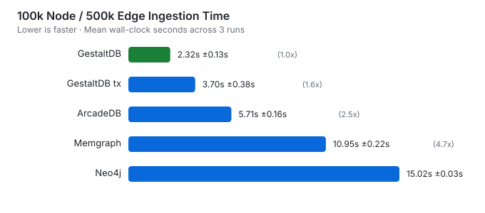
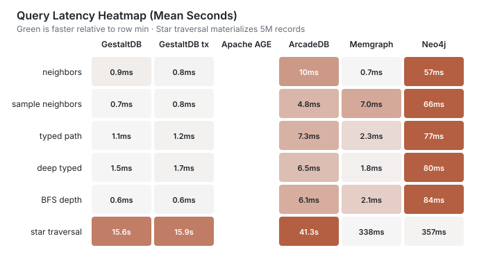

Performance and Benchmarks
==========================

GestaltDB includes benchmark scripts for ingestion, traversal, sampling, RocksDB
tuning, and external graph database comparisons. Treat the included results as
directional examples, not universal claims.

Practical Recommendations
-------------------------

For the library as it exists today, choose ingestion and storage options by the
shape of the workload rather than by a single global default:

- Use ``PyRexStore``/RocksDB for large append-only loads, columnar ingestion, and
  write-heavy workloads where native batch writes and RocksDB tuning matter.
- Use ``PyRexStore(transactional=True)`` only when graph-level RocksDB
  transactions are required. The transaction-capable backend currently cannot use
  PyRex's native columnar writer, so append-only bulk loads should usually keep
  the default RocksDB backend.
- Use ``LevelDBStore`` for simple local graphs, predictable installs through
  ``plyvel``, and workloads where the graph is small enough that Python object
  construction dominates storage I/O.
- Use ``LMDBStore`` when you want LMDB's mature embedded storage model and can
  size ``map_size`` ahead of loading. LMDB is not the optimized path for the
  current Arrow/Polars native columnar ingestion work.
- Prefer ``JSONSerializer`` with Polars or Arrow entity-column ingestion when
  data starts as tabular JSON-compatible columns. This avoids constructing
  ``Node`` and ``Edge`` objects per row and can move payload construction into
  Polars' vectorized JSON encoder.
- Prefer pre-serialized ``node_value`` and ``edge_value`` columns when upstream
  data already has serializer-compatible payload bytes. This isolates the
  backend write path and avoids repeated serialization in GestaltDB.
- Use ``IndexMaintenanceMode.MAINTAIN`` for incremental writes or when indexed
  queries must be valid immediately after each ingestion call.
- Use ``IndexMaintenanceMode.DEFER`` when the write window matters most and you
  can explicitly call ``GraphDB.rebuild_deferred_indexes()`` before indexed
  queries.
- Use ``IndexMaintenanceMode.DEFER_REBUILD`` as the safest bulk-load convenience
  mode: it defers secondary-index writes during ingestion and rebuilds stale
  indexes before returning.

The important deferred-index trade-off is latency placement. Deferring index
maintenance can make the write phase much faster, but a full rebuild still has to
scan stored graph records. If you include an immediate rebuild in the same timed
operation, total wall-clock time may be higher for some graph sizes and index
sets. The current implementation is best viewed as a way to shorten the critical
write window and make index rebuilding explicit and safe, not as a universal
end-to-end speedup.

Install Benchmark Dependencies
------------------------------

.. code-block:: sh

   python -m pip install -e ".[leveldb,rocksdb,fast-ingest]"

Backend Benchmarks
------------------

Temporal Hardening Smoke
~~~~~~~~~~~~~~~~~~~~~~~~

``python -m benchmarks temporal`` runs a deterministic generated workload over
temporal writes, as-of lookups, snapshot construction, seeded temporal sampling,
rule evaluation, and modal entailment. It reports write throughput, query p50/p95
latency, phase timings, peak ``tracemalloc`` memory, database bytes, and storage
amplification relative to serialized entity payloads.

.. code-block:: sh

   python -m benchmarks temporal \
      --backend leveldb --serializer json \
      --nodes 1000 --edges 5000 --queries 1000 --interval-versions 1000 \
      --seed 42 --output benchmark_results/temporal-smoke.json

The seed and generated graph are deterministic; elapsed time, traced memory, and
backend file size are environment-dependent observations. CI smoke tests assert
workload counts and outcomes, never timing thresholds. Run a backend/serializer
matrix on deployment hosts before setting service objectives.

``--interval-versions`` adds adjacent closed intervals for one logical entity
and reports ``interval_candidates_decoded``. The valid-start/valid-end index
intersection should decode one active interval for the generated point query,
independent of the requested interval-history size.

Use ``benchmarks/quick.py`` (or ``python -m benchmarks quick``; ``benchmarks.py`` is retained as a compatibility forwarder) for a quick backend comparison on the same append-only
workload.

.. code-block:: sh

   python -m benchmarks quick --backend leveldb --nodes 20000 --edges 100000 --batch-size 10000 --append-only
   python -m benchmarks quick --backend rocksdb --nodes 20000 --edges 100000 --batch-size 10000 --append-only
   python -m benchmarks quick --backend rocksdb --nodes 20000 --edges 100000 --batch-size 10000 --append-only --rocksdb-transactional

Use ``benchmarks/matrix.py`` (or ``python -m benchmarks matrix``) for larger matrix runs across graph sizes,
backends, core counts, and ingestion modes.

.. code-block:: sh

   uv run python -m benchmarks matrix \
      --sizes 10000 100000 1000000 \
      --edge-multiplier 1 \
      --cores 1 2 4 \
      --backends leveldb rocksdb \
      --ingestion-modes object arrow polars \
      --chunk-size 100000 \
      --samples 1000 \
      --sample-size 5 \
      --output-dir benchmark_results/matrix_YYYYMMDD

The matrix writes CSV and JSONL outputs and reopens the database before traversal
workloads so traversal does not only measure Python-side object state.

To compare default RocksDB with transaction-capable RocksDB on a 5 edges/node
shape:

.. code-block:: sh

   python -m benchmarks matrix \
      --backends rocksdb \
      --rocksdb-configs parallel-buffer64mb-bloom10 parallel-buffer64mb-bloom10-transactional \
      --sizes 10000 100000 \
      --edge-multiplier 5 \
      --cores 4 \
      --ingestion-modes arrow polars \
      --serializer pickle \
      --chunk-size 10000 \
      --samples 100 \
      --sample-size 5 \
      --output-dir benchmark_results/transactions_rocksdb_YYYYMMDD

Columnar Ingestion Benchmarks
-----------------------------

Columnar ingestion accepts already-serialized node and edge payloads. With
``PyRexStore`` and ``pyrex-rocksdb>=0.4.1``, RocksDB can use PyRex's native
``write_columnar_batch`` path. When Arrow-backed string or binary arrays are
passed, GestaltDB preserves those arrays through chunking and passes value
columns directly to PyRex instead of materializing Python ``bytes`` for every
stored value.

Structured JSON Entity Ingestion
--------------------------------

For ``JSONSerializer`` workloads, use the structured entity helpers to build
node and edge payloads from Polars or Arrow columns. GestaltDB uses Polars
``struct`` JSON encoding to serialize the payload column outside the Python
row loop, then sends the resulting Arrow binary values through the native PyRex
columnar write path when available.

.. code-block:: python

   import polars as pl

   from gestaltdb.graphdb import GraphDB
   from gestaltdb.kvstores import PyRexStore
   from gestaltdb.serializers import JSONSerializer

   graph = GraphDB(PyRexStore(path="graph_rocksdb"), JSONSerializer())

   nodes = pl.DataFrame({
       "node_id": ["drug-1", "protein-1"],
       "labels": [["Drug"], ["Protein"]],
       "kind": ["drug", "protein"],
   })
   graph.ingest_nodes_polars_entities(
       nodes,
       property_columns=["kind"],
   )

   edges = pl.DataFrame({
       "edge_id": ["d1-p1"],
       "source": ["drug-1"],
       "target": ["protein-1"],
       "edge_type": ["binds"],
       "score": [0.9],
   })
   graph.ingest_edges_polars_entities(
       edges,
       property_columns=["score"],
   )

This path is most useful when Python serialization dominates ingestion time.
It avoids constructing ``Node`` and ``Edge`` objects per row for JSON-compatible
payloads. Non-JSON serializers still work through the same methods, but they
fall back to Python object serialization so they do not get the same
serialization speedup.

Arrow inputs can use the same optimized JSON path when Polars is installed:

.. code-block:: python

   import pyarrow as pa

   graph.ingest_nodes_arrow_entities(
       pa.array(["n1", "n2"]),
       labels=pa.array([["Entity"], ["Entity"]]),
       properties={"kind": pa.array(["drug", "protein"])},
   )

   graph.ingest_edges_arrow_entities(
       pa.array(["e1"]),
       pa.array(["n1"]),
       pa.array(["n2"]),
       pa.array(["binds"]),
       properties={"score": pa.array([0.9])},
   )

See ``notebooks/05_columnar_ingestion_benchmark.ipynb`` for a runnable example.
Representative rates for 10,000 nodes, 50,000 edges, and batch size 10,000:

============================== =============== ================
Mode                           Node rate       Edge insert rate
============================== =============== ================
LevelDB object batch           1,110,296/s     167,463 edges/s
RocksDB Arrow columnar native  1,035,690/s     265,050 edges/s
RocksDB Polars columnar native 929,044/s       250,517 edges/s
============================== =============== ================

Larger append-only workloads with pre-serialized columnar payloads are expected
to benefit more than small runs dominated by Python object construction.

End-to-End Ingestion Insights
-----------------------------

``notebooks/06_end_to_end_ingestion_benchmark.ipynb`` measures serialization plus
ingestion. The results below use 100,000 nodes, 500,000 edges, batch size 10,000,
``JSONSerializer``, RocksDB native columnar ingestion, WAL enabled, RocksDB
parallelism 4, and a 64 MiB write buffer. Dataset generation and database
setup/cleanup are excluded.

==================================== ===================== ============= ========= ======== =================
Case                                 Isolates              Serialization Ingestion Rebuild  Total
==================================== ===================== ============= ========= ======== =================
LevelDB + Python JSON                baseline backend      0.882 s       3.066 s   0.000 s  3.948 s
RocksDB + Python JSON                RocksDB backend       0.916 s       2.484 s   0.000 s  3.400 s
RocksDB + Polars JSON                serialization path    0.494 s       2.400 s   0.000 s  2.894 s
RocksDB + Polars, maintain indexes   inline indexes        n/a           12.269 s  0.000 s  12.269 s
RocksDB + Polars, defer then rebuild deferred indexes      n/a           1.407 s   12.973 s 14.380 s
==================================== ===================== ============= ========= ======== =================

The same run showed these relative results:

=========================================================== ===============================
Comparison                                                  Result
=========================================================== ===============================
RocksDB vs LevelDB, same Python JSON path                   1.16x faster total
RocksDB vs LevelDB, ingestion/write phase only              1.23x faster write phase
Polars JSON vs Python JSON serialization on RocksDB         1.86x faster serialization
Polars JSON vs Python JSON end-to-end on RocksDB            1.17x faster total
Deferred index write phase vs inline index maintenance      8.72x faster write phase
Deferred index plus rebuild vs inline index maintenance     17.2% higher total time
=========================================================== ===============================

Interpretation:

- RocksDB's native columnar path helped the write phase on the measured workload,
  but the total gain was moderate because serialization was still a large share
  of wall-clock time.
- Polars JSON payload construction reduced serialization time substantially for
  JSON-compatible tabular inputs.
- Deferring index construction shifted work out of the write phase. This is useful
  when ingestion must complete quickly before a later rebuild step, but it was not
  faster end-to-end when the rebuild was performed immediately for this 100k node
  and 500k edge subset with node indexes on ``kind`` and ``group`` plus an edge
  index on ``weight``.
- Benchmark your actual graph shape and index set before promising absolute
  speedups. The fastest mode for append-only writes is not always the fastest mode
  for ingest-plus-query-ready indexes.

Transaction-Capable RocksDB Benchmark
-------------------------------------

``PyRexStore(transactional=True)`` opens RocksDB through PyRex's
``TransactionDB`` support. It provides graph-level transactions through
``GraphDB.transaction()``, and regular direct writes still work through the same
public GestaltDB APIs. The trade-off is that PyRex 0.4.1 exposes native
``write_columnar_batch`` on ``PyRocksDB`` but not on ``TransactionDB``. The
transaction-capable backend therefore falls back to Python ``PyWriteBatch`` paths
for columnar ingestion.

The table below reports write-phase times for 5 edges per node, RocksDB
parallelism 4, ``max_background_jobs=4``, a 64 MiB write buffer, Bloom filters,
Pickle payloads, and chunk size 10,000.

.. list-table::
   :header-rows: 1

   * - Nodes / edges
     - Mode
     - RocksDB backend
     - Native columnar
     - Node write
     - Edge write
   * - 10,000 / 50,000
     - Arrow
     - default
     - yes
     - 0.041 s
     - 0.185 s
   * - 10,000 / 50,000
     - Arrow
     - transaction-capable
     - no
     - 0.049 s
     - 0.345 s
   * - 10,000 / 50,000
     - Polars
     - default
     - yes
     - 0.046 s
     - 0.187 s
   * - 10,000 / 50,000
     - Polars
     - transaction-capable
     - no
     - 0.050 s
     - 0.343 s
   * - 100,000 / 500,000
     - Arrow
     - default
     - yes
     - 0.457 s
     - 1.886 s
   * - 100,000 / 500,000
     - Arrow
     - transaction-capable
     - no
     - 0.540 s
     - 3.623 s
   * - 100,000 / 500,000
     - Polars
     - default
     - yes
     - 0.429 s
     - 1.828 s
   * - 100,000 / 500,000
     - Polars
     - transaction-capable
     - no
     - 0.545 s
     - 3.670 s

The object-path benchmark with 20,000 nodes and 100,000 append-only edges measured
77,571 edges/s on default RocksDB versus 64,649 edges/s on transaction-capable
RocksDB. Treat this as the expected cost of opening the backend in
transaction-capable mode, not the cost of wrapping a large write in one user
transaction.

Operational guidance:

- Use default ``PyRexStore`` for reloadable bulk loads and columnar append-only
  ingestion.
- Use ``PyRexStore(transactional=True)`` when mutations must be atomic across
  nodes, edges, adjacency, secondary indexes, and metadata.
- If transaction-capable bulk ingestion needs native columnar throughput, PyRex
  should expose ``TransactionDB.write_columnar_batch`` so GestaltDB can keep the
  same fast path in transactional mode.

RocksDB Tuning and Compaction Benchmarks
----------------------------------------

Use ``benchmarks/tuning.py`` (or ``python -m benchmarks tuning``) for a small RocksDB tuning matrix against a
LevelDB baseline.

.. code-block:: sh

   python -m benchmarks tuning --nodes 20000 --edges 100000 --batch-size 10000

Use ``benchmarks/compaction.py`` (or ``python -m benchmarks compaction``) for a repeated-overwrite workload
that creates compaction pressure.

.. code-block:: sh

   uv run python -m benchmarks compaction \
      --configs leveldb rocksdb-p1-bg1-smallbuf rocksdb-p4-bg4-smallbuf rocksdb-p8-bg8-smallbuf rocksdb-p4-bg4-largebuf \
      --keys 250000 \
      --passes 6 \
      --batch-size 5000 \
      --value-size 1024 \
      --output-dir benchmark_results/compaction_pressure_YYYYMMDD

Representative compaction-pressure result:

================================= =========== ===================== =================== =============
Configuration                     Backend     Initial write rate    Overwrite avg rate  Final SSTs
================================= =========== ===================== =================== =============
LevelDB                           LevelDB     329,433 writes/s      114,663 writes/s    30
RocksDB p1/bg1 small buffer       RocksDB     694,105 writes/s      262,405 writes/s    14
RocksDB p4/bg4 small buffer       RocksDB     1,008,871 writes/s    749,948 writes/s    47
RocksDB p8/bg8 small buffer       RocksDB     987,248 writes/s      772,436 writes/s    17
RocksDB p4/bg4 large buffer       RocksDB     1,088,475 writes/s    1,132,815 writes/s  7
================================= =========== ===================== =================== =============

This workload favors RocksDB because it creates overlapping sorted runs that can
benefit from background compaction parallelism. It should not be generalized to
all graph workloads.

External Graph Database Benchmarks
----------------------------------

Use ``benchmarks/external.py`` (or ``python -m benchmarks external``) to compare GestaltDB/RocksDB with
Neo4j, Memgraph, ArcadeDB, and Apache AGE on the same deterministic graph shapes.
The runner reports ingestion and query phases separately and validates loaded node
and edge counts before comparing query timings.

Ingestion paths differ by engine:

- GestaltDB uses Arrow/Polars entity ingestion into RocksDB.
- Neo4j and Memgraph use batched Cypher over Bolt for ingestion and batched
  seed queries with ``UNWIND`` for traversal workloads.
- ArcadeDB uses the embedded ``GraphBatch`` API.
- Apache AGE uses ``cypher()`` through PostgreSQL for ingestion and queries. Pass
  ``--age-require-index`` when you want the runner to add a GIN property index on
  ``Node.properties`` before query timing.

Traversal workloads use each engine's query interface. GestaltDB uses
``GraphDB.query()`` for neighbor expansion, star traversal, typed paths, and the
deeper typed traversal. ``bfs_depth`` is a client-side BFS loop over typed neighbor
queries for every engine. These are end-to-end query API timings, not raw
storage-layer timings. Neo4j and Memgraph do not expose a stable public storage
API comparable to direct RocksDB writes, so storage-only comparisons should be
kept separate from this benchmark.

Install the optional benchmark dependencies:

.. code-block:: sh

   uv sync --extra fast-ingest --extra external-bench

Benchmark Suite Validation
~~~~~~~~~~~~~~~~~~~~~~~~~~

The modular benchmark runners were validated locally with the repository's
optional benchmark extras installed via ``uv sync --extra all``. Smoke tests used
small graph sizes to exercise every command path, and the documented 100k node /
500k edge comparison runs were executed for engines that complete at that scale.

.. list-table::
   :header-rows: 1

   * - Runner
     - Parameters
     - Result
   * - ``quick``
     - 200 nodes, 1,000 edges; LevelDB, RocksDB, LMDB
     - completed successfully for all three backends
   * - ``matrix``
     - 200 nodes, 5 edges/node; LevelDB and RocksDB; object, Arrow, Polars
     - 12/12 rows reported ``status=ok``
   * - ``compaction``
     - 200 keys, 2 passes; LevelDB and RocksDB small-buffer preset
     - completed and wrote CSV/JSONL outputs
   * - ``sampler``
     - 200 nodes, 1,000 edges, 20 iterations
     - completed; tiny graphs are dominated by setup overhead, so do not use this run for speedup claims
   * - ``tuning``
     - 200 nodes, 1,000 edges across the RocksDB preset sweep
     - completed and wrote JSON/CSV outputs
   * - ``profiling``
     - 200 nodes, 1,000 edges; LevelDB pickle and RocksDB JSON/Polars cases
     - completed and wrote profile summaries
   * - ``embedded``
     - 200 nodes, 1,000 edges; GestaltDB, LatticeDB, LadybugDB
     - GestaltDB and LatticeDB completed; LadybugDB completed after adapting to the current ``ladybug`` connection API
   * - ``arcadedb``
     - 200 nodes, 1,000 edges; GestaltDB, transactional GestaltDB, ArcadeDB
     - completed after adapting to ``arcadedb-embedded``'s current ``create_database`` API
   * - ``external``
     - 100 nodes, 300 edges; GestaltDB, transactional GestaltDB, ArcadeDB, Neo4j, Memgraph, AGE
     - all engines completed after switching AGE to the available ``apache/age:latest`` image and using AGE-compatible Cypher literals
   * - ``plotting``
     - generated SVG files from an external benchmark summary JSONL file
     - completed successfully

Full-scale runs completed for:

- ``external``: 100,000 nodes, 500,000 edges, 10 traversal seeds, three
  repetitions for GestaltDB, transactional GestaltDB, Neo4j, Memgraph, and
  ArcadeDB across all advertised workloads.
- ``embedded``: 100,000 nodes, 500,000 edges, 10 traversal seeds, three
  repetitions for GestaltDB, LatticeDB, and LadybugDB across all advertised
  embedded workloads.
- Apache AGE completed the 100,000 node / 500,000 edge ingest workload, but its
  row-wise ``cypher()`` ingestion path took 13,318.887 seconds for a single run.
  The all-workload AGE run did not complete within a 6-hour timeout and is
  excluded from the 100k comparison tables below.

When validating a new environment, inspect the raw ``status`` and
``skip_reason`` columns before comparing timings. Optional engines can fail for
reasons outside GestaltDB itself, such as unavailable Docker images or upstream
Python API changes.

Embedded Python Graph Databases
~~~~~~~~~~~~~~~~~~~~~~~~~~~~~~~

Use ``benchmarks/embedded.py`` (or ``python -m benchmarks embedded``) for a local embedded-engine
comparison between GestaltDB/RocksDB, LatticeDB, and LadybugDB. LatticeDB uses
its native Python transaction API. LadybugDB uses the PyPI ``ladybug`` package,
CSV ``COPY`` ingestion, and Cypher traversal queries.

.. code-block:: sh

   uv run python -m benchmarks embedded \
      --engines gestaltdb latticedb ladybugdb \
      --workloads ingest neighbors sample_neighbors star_traversal bfs_depth typed_path \
      --nodes 100000 \
      --edges 500000 \
      --batch-size 10000 \
      --iterations 10 \
      --repetitions 3 \
      --output-dir benchmark_results/embedded_graphdbs_100k

Representative full comparison:

.. code-block:: sh

   uv run python -m benchmarks external \
      --engines gestaltdb gestaltdb-tx neo4j memgraph arcadedb \
      --workloads columnar_ingest neighbors sample_neighbors star_traversal bfs_depth typed_path deep_typed_query \
      --nodes 100000 \
      --edges 500000 \
      --batch-size 10000 \
      --iterations 10 \
      --repetitions 3 \
      --cypher-query-mode batched \
      --age-require-index \
      --output-dir benchmark_results/external_graphdbs_100k

Generate the documentation plots from one or more summary files:

.. code-block:: sh

   python -m benchmarks plotting \
      benchmark_results/external_graphdbs_100k/external_graphdbs_summary.jsonl \
      --output-dir docs/_static

100k Node Results
~~~~~~~~~~~~~~~~~

These results use 100,000 nodes, 500,000 edges, batch size 10,000, 10 traversal
seeds, sample size 5, depth 3, and three repetitions. All included rows
validated exactly 100,000 nodes and 500,000 edges. Tables report mean ± standard
deviation.

Ingestion phase from the ``columnar_ingest`` workload:

.. list-table::
   :header-rows: 1

   * - Engine
     - Ingest seconds
     - Edge ingest rate
     - Relative to GestaltDB
   * - GestaltDB/RocksDB
     - 2.320 ± 0.126 s
     - 215,983 edges/s
     - 1.00x
   * - GestaltDB/RocksDB transactional
     - 3.703 ± 0.377 s
     - 136,027 edges/s
     - 1.60x slower
   * - ArcadeDB embedded
     - 5.706 ± 0.161 s
     - 87,672 edges/s
     - 2.46x slower
   * - Memgraph
     - 10.946 ± 0.218 s
     - 45,691 edges/s
     - 4.72x slower
   * - Neo4j
     - 15.019 ± 0.032 s
     - 33,292 edges/s
     - 6.47x slower

Query phase on the already-loaded graph:

.. list-table::
   :header-rows: 1

   * - Workload
     - Result count
     - GestaltDB
     - GestaltDB tx
     - ArcadeDB
     - Memgraph
     - Neo4j
   * - neighbors
     - 17
     - 0.000923 ± 0.000366 s
     - 0.000769 ± 0.000023 s
     - 0.010 ± 0.009 s
     - 0.000735 ± 0.000259 s
     - 0.057 ± 0.005 s
   * - sample_neighbors
     - 17
     - 0.000732 ± 0.000037 s
     - 0.000752 ± 0.000006 s
     - 0.004819 ± 0.002178 s
     - 0.006972 ± 0.001713 s
     - 0.066 ± 0.001 s
   * - star_traversal
     - 5,000,000
     - 15.595 ± 2.881 s
     - 15.918 ± 2.731 s
     - 41.286 ± 0.455 s
     - 0.338 ± 0.018 s
     - 0.357 ± 0.016 s
   * - bfs_depth
     - 3
     - 0.000573 ± 0.000020 s
     - 0.000601 ± 0.000018 s
     - 0.006133 ± 0.008613 s
     - 0.002087 ± 0.000402 s
     - 0.084 ± 0.003 s
   * - typed_path
     - 125
     - 0.001069 ± 0.000023 s
     - 0.001195 ± 0.000046 s
     - 0.007271 ± 0.001547 s
     - 0.002314 ± 0.000053 s
     - 0.077 ± 0.004 s
   * - deep_typed_query
     - 57
     - 0.001523 ± 0.000006 s
     - 0.001673 ± 0.000047 s
     - 0.006489 ± 0.001029 s
     - 0.001751 ± 0.000125 s
     - 0.080 ± 0.003 s

Notes:

- GestaltDB remains fastest on ingestion among the engines included in the full
  100k comparison table. AGE's row-wise ``cypher()`` path is currently much
  slower at this scale and is not included in the full comparison table.
- GestaltDB's traversal timings are dominated by embedded typed-adjacency prefix
  scans. Server engines pay query execution and client/server costs for the small
  seeded traversals. Neo4j and Memgraph rows use batched Cypher seed queries to
  avoid one Bolt round-trip per seed.
- For AGE, the 100k ``columnar_ingest`` workload completed one run in
  13,318.887 seconds, or 37.5 edges/s. That result identifies the current AGE
  adapter as unsuitable for full-scale comparisons until it uses a true bulk load
  path.
- ``reopen_seconds`` and count validation are recorded separately in summary files
  and are not included in query timings.
- The star traversal deliberately materializes 5,000,000 rows to the client, so
  it measures server traversal plus result streaming and client decoding. Use a
  count-only workload if you want to isolate server-side traversal execution.

Embedded 100k Node Results
~~~~~~~~~~~~~~~~~~~~~~~~~~

The embedded comparison uses 100,000 nodes, 500,000 edges, batch size 10,000,
10 traversal seeds, sample size 5, depth 3, and three repetitions. All rows
reported ``status=ok`` and validated the expected node and edge counts.

.. list-table:: Ingestion phase from the ``ingest`` workload
   :header-rows: 1

   * - Engine
     - Ingest seconds
     - Edge ingest rate
   * - GestaltDB/RocksDB
     - 7.848 ± 0.027 s
     - 63,709 edges/s
   * - LatticeDB
     - 122.191 ± 0.724 s
     - 4,092 edges/s
   * - LadybugDB
     - 0.966 ± 0.022 s
     - 517,582 edges/s

.. list-table:: Query phase on the already-loaded embedded graph
   :header-rows: 1

   * - Workload
     - Result count
     - GestaltDB
     - LatticeDB
     - LadybugDB
   * - neighbors
     - 17
     - 0.000258 ± 0.000007 s
     - 0.001698 ± 0.000347 s
     - 0.006641 ± 0.000845 s
   * - sample_neighbors
     - 17
     - 0.000273 ± 0.000005 s
     - 0.001812 ± 0.000051 s
     - 0.007306 ± 0.001363 s
   * - star_traversal
     - 5,000,000
     - 3.183 ± 0.018 s
     - 25.100 ± 0.154 s
     - 0.011 ± 0.000 s
   * - bfs_depth
     - engine-specific
     - 0.000158 ± 0.000003 s
     - 0.001882 ± 0.000059 s
     - 0.053 ± 0.001 s
   * - typed_path
     - 125
     - 0.000470 ± 0.000005 s
     - 0.002386 ± 0.000178 s
     - 0.016 ± 0.001 s

LadybugDB's full-scale result is very fast on this benchmark shape because its
CSV ``COPY`` ingest and query execution path fit the generated workload well.
As with all benchmark rows here, compare against your own graph shape and query
mix before generalizing.

Benchmark Caveats
-----------------

- Local benchmark results depend on graph shape, storage device, CPU settings,
  Python version, backend versions, and warm-up behavior.
- Small graphs can be dominated by Python object construction, serialization, and
  key construction rather than backend I/O.
- Prefer raw CSV/JSONL outputs for comparisons and keep benchmark parameters with
  published results.
